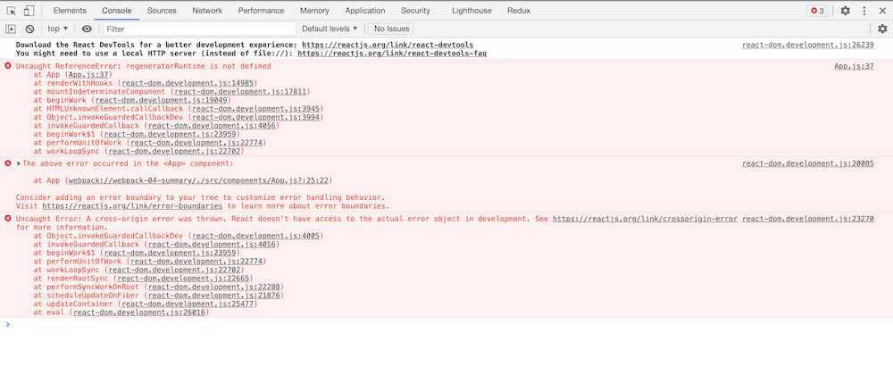

## This project is a demostration about react + webpack + html + (JSX/babel-loader) + css-loader + HtmlWebpackPlugin + webpack es6 async + webpack server & proxy, entirelly work flow.

- Phase 5: Summary
- `Works on 8/7/2021`

### Dependencies version

- webpack 5

1. .gitignore file

```bash
$ touch .gitignore

# node_modules
```

2. Install dependencies.

```bash
$ npm init -y
$ npm install react react-dom
$ npm install --save-dev webpack webpack-cli babel-loader @babel/core @babel/preset-env @babel/preset-react css-loader style-loader html-webpack-plugin @babel/plugin-transform-runtime @babel/plugin-transform-regenerator
```

3. ./public/index.html `(add html file)`

- 注意这里不用使用 script，后面使用了 heml-webpack-plugin 实现了这个功能。

```html
<!DOCTYPE html>
<html lang="en">
  <head>
    <meta charset="UTF-8" />
    <meta name="viewport" content="width=device-width, initial-scale=1.0" />
    <meta http-equiv="X-UA-Compatible" content="ie=edge" />
    <title>Phase5-Summary</title>
  </head>
  <body>
    <div id="root"></div>
  </body>
</html>
```

4. ./src/index.js `(add index.js)`

```js
import React from 'react';
import ReactDOM from 'react-dom';
import App from './components/App';

import './index.css';

ReactDOM.render(
  React.createElement(App, {
    message:
      '< Html + React + Webpack + JSX + Babel-loader + CSS-loader + Plugin +  webpack server & proxy + webpack async >',
  }),
  document.getElementById('root')
);
```

5. ./src/components/App.js `(add component)`

```js
import React, { useState, useEffect, Fragment } from 'react';

const App = ({ message }) => {
  const [user, setUser] = useState({});

  useEffect(() => {
    fetch('https://jsonplaceholder.typicode.com/todos/1')
      .then((response) => response.json())
      .then((json) => setUser(json));
  });

  const { userId, id, title, completed } = user;

  return (
    <div>
      <Fragment>
        <h2>Props message from index.js file</h2>
        <h3>{message} success!</h3>
      </Fragment>
      <Fragment>
        <h2>Async request from jsonPlaceholder</h2>
        <ul>
          <li>User id:{userId}</li>
          <li>Id:{id}</li>
          <li>Title:{title}</li>
          <li>Completed:{completed ? `Yes` : `No`}</li>
        </ul>
      </Fragment>
    </div>
  );
};

export default App;
```

6. ./src/index.css `(add css file)`

```css
body {
  color: white;
  background-color: grey;
}
```

7. ./src/webpack.config.js `(add webpack configuration.)`

```js
const path = require('path');
const HtmlWebpackPlugin = require('html-webpack-plugin');

module.exports = {
  mode: 'development',
  entry: './src/index.js',
  output: {
    filename: 'main.js',
    path: path.resolve(__dirname, 'dist'),
  },
  module: {
    rules: [
      {
        test: /\.m?js$/,
        exclude: /(node_modules|bower_components)/,
        use: {
          loader: 'babel-loader',
          options: {
            presets: ['@babel/preset-env'],
          },
        },
      },
      {
        test: /\.css$/i,
        use: ['style-loader', 'css-loader'],
      },
    ],
  },
  plugins: [
    new HtmlWebpackPlugin({
      template: __dirname + '/public/index.html',
      filename: 'index.html',
    }),
  ],
};
```

8. ./src/babel.config.json `(add babel configuration.)`

```json
{
  "presets": ["@babel/preset-env", "@babel/preset-react"]
}
```

9. ./src/package.json `(add scripts.)`

```json
"scripts": {
  "build": "webpack"
}
```

10. Run the html file.

```bash
$ npm run build
$ cd dist
$ open index.html
```

11. 实施重点

```diff
+ 因为 webpack 的配置比较多，所以理清文件结构很重要，尤其是初学者可以先记住常用格式和结构，熟练后再改动。
```

12. 8/4 webpack server & proxy 补充：

- 添加 react frontend 的 webpack server 功能，并添加对应后端的 proxy。
- webpack server 的一个作用类似后端的 nodemon，主要用于方便调试。

- 方案：

  - [npm webpack-dev-server website.](https://www.npmjs.com/package/webpack-dev-server)
  - [添加 script](https://stackoverflow.com/questions/40379139/cannot-find-module-webpack-bin-config-yargs), `(解决错误：Cannot find module 'webpack/bin/config-yargs')`
  - [添加 proxy](https://riptutorial.com/webpack/example/30415/using-proxy)

- 具体代码：

  1. 安装 webpack-dev-server

     ```bash
     $ npm install webpack-dev-server --save-dev
     ```

  2. 添加 script：(./client/package.json)

     ```json
     "scripts": {
       "start": "webpack serve"
     },
     ```

  3. 添加 proxy。(./webpack.config.js)

  - `这里要重点讲的是，webpack serve 默认把 client 的端口放在 8080， 而这一步的 proxy 设置主要是用于沟通后端的端口`。

    ```js
    devServer: {
      proxy: {
        '/': {
          target: 'http://localhost:3000',
        },
      }
    }
    ```

  - 以上这个配置就是告诉 react 每当向后端发送请求时，`/`路径代表`http://localhost:3000`，也就是后端的端口。

13. 8/4 webpack async 补充：

- babel 需要添加翻译 Es6 新语法 async 的功能，如果不处理，就可能出现以下问题。

  ```diff
  - Error: regeneratorRuntime is not defined
  ```

---

<p align="center">

</p>

---

- Doc：[Click here - English edition.](https://dev.to/hulyakarakaya/how-to-fix-regeneratorruntime-is-not-defined-doj)

14. 8/7 关于 webpack async 的补充

- 上面这个问题出现的原因是 babel 不能翻译 Es6 async 关键词才出现的，而旧一点的 fetch 都可以翻译,更好的解决方法是：

  1. install plugins.

     ```bash
     $ npm i -D @babel/plugin-transform-runtime
     $ npm i -D @babel/plugin-transform-regenerator
     ```

  2. ./src/babel.config.json `(add babel plugins.)`

     ```json
     {
       "presets": ["@babel/preset-env", "@babel/preset-react"],
       "plugins": [
         "@babel/plugin-transform-runtime",
         "@babel/plugin-transform-regenerator"
       ]
     }
     ```

- Doc：[Click here - Chinese edition.](https://blog.csdn.net/weixin_42821179/article/details/104063118)
